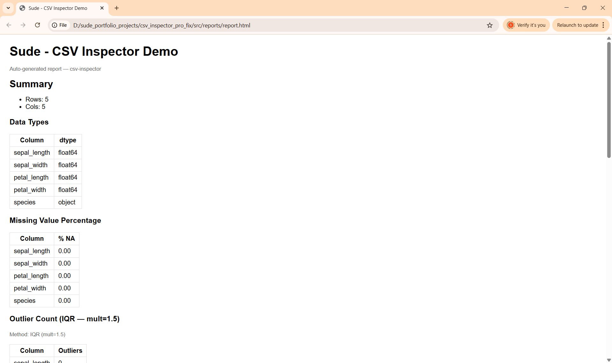
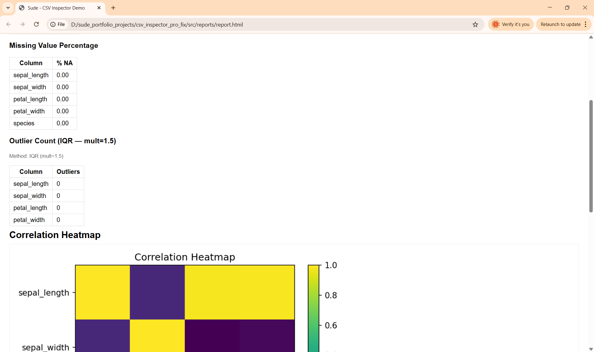
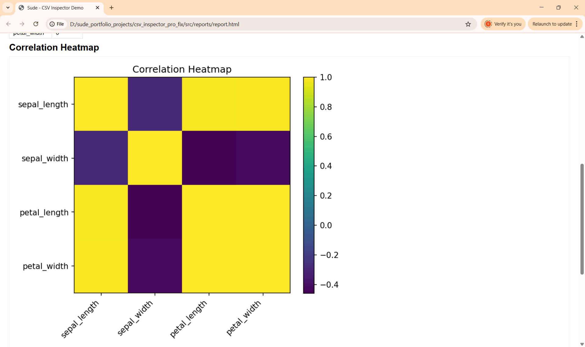
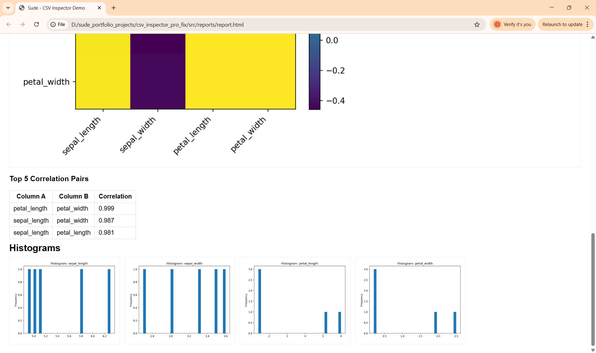

# csv-inspector (Pro)

A command-line tool to analyze your CSV files in seconds, producing statistical summaries, outlier detection results, and a fully visualized HTML report.

This Pro version enhances the basic CSV inspection process with:

Outlier detection — Identify anomalies using Z-score or IQR methods

Correlation analysis — Heatmap visualization and top correlated pairs filter (--corr-min)

Data visualization — Histograms and correlation heatmaps for instant insights

Customizable HTML report title — Set a custom title using --title

Target audience: Data analysts, data scientists, engineers, and anyone who needs quick dataset exploration

Purpose: Provide both numerical and visual summaries of a dataset with a single command

---

## Installation
```bash
python -m venv .venv
# Windows:
.venv\Scripts\activate
# Mac/Linux:
source .venv/bin/activate

pip install -r requirements.txt

```

## Usage
```bash
python -m csv_inspector path/to/data.csv [options]

```
## Arguments
| Argument           | Type / Default           | Description                                      |
| ------------------ | ------------------------ | ------------------------------------------------ |
| `csv_path`         | **required**             | Path to the CSV file                             |
| `--sep`            | `,`                      | CSV delimiter                                    |
| `--limit`          | `None`                   | Read only the first N rows                       |
| `--out`            | `reports`                | Output directory                                 |
| `--max-hist`       | `8`                      | Maximum number of histograms                     |
| `--html`           | flag                     | Generate HTML report                             |
| `--outlier-method` | `z`                      | Outlier detection method: `z` (Z-score) or `iqr` |
| `--zthresh`        | `3.0`                    | Z-score threshold                                |
| `--iqr-mult`       | `1.5`                    | IQR multiplier                                   |
| `--corr-min`       | `0.0`                    | Minimum absolute correlation for top pairs       |
| `--title`          | `"CSV Inspector Report"` | Title for HTML report                            |


## Examples
```bash

# 1) Basic HTML report
python -m csv_inspector examples/sample.csv --html

# 2) Outlier detection using IQR
python -m csv_inspector examples/outliers.csv --html --outlier-method iqr --iqr-mult 1.5 --title "Outlier Demo"

# 3) Correlation filter
python -m csv_inspector examples/sample.csv --html --corr-min 0.5 --title "Iris Dataset Report"

```
## Output Files
reports/summary.json

reports/hist_*.png

reports/corr_heatmap.png

reports/report.html (open in browser)

## Example Output







## How It Works

1. Data Loading — Reads CSV with optional delimiter and row limit

2. Summary Statistics — Calculates count, mean, std, min, max, and more

3. Outlier Detection — Applies Z-score or IQR method per column

4. Correlation Analysis — Generates heatmap and top correlation pairs

5. Visualization — Saves histograms and heatmap as PNG images

6. HTML Report — Combines all results into a single styled HTML page

## Future Improvements

 Add support for Excel files (.xlsx)

 Interactive HTML report with Plotly charts

 Option to export summary as PDF

 CLI auto-detection of delimiter

 Batch processing for multiple CSVs

